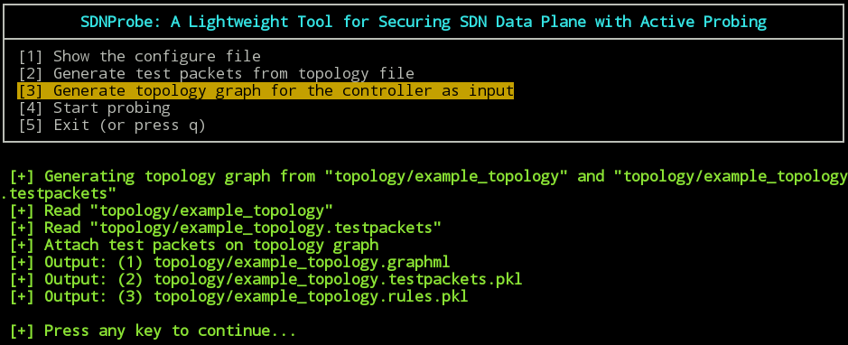

# SDNProbe: A Lightweight Tool for Securing SDN Data Plane with Active Probing

**Table of Contents**
- [SDNProbe: A Lightweight Tool for Securing SDN Data Plane with Active Probing](#SDNProbe)
  - [What is SDNProbe?](#what-is-sdnprobe?)
  - [SDNProbe Properties](#sdnprobe-properties)
  - [Prerequisites](#prerequisites)
  - [Installing SDNProbe](#installing-sdnprobe)
  - [Configuring SDNProbe](#configuring-sdnprobe)
    - [Topology File](#topology-file)
    - [Detection Threshold](#detection-threshold)
    - [Test Packet Rate](#test-packet-rate)
    - [Attack Simulation](#attack-simulation)
    - [Monitor Mode](#monitor-mode)
  - [Running SDNProbe](#running-sdnprobe)
    - [STEP 1. Show the configure file](#step-1.-show-the-configure-file)
    - [STEP 2. Generate test packets from topology file](#step-2.-generate-test-packets-from-topology-file)
    - [STEP 3. Generate topology graph for the controller as input](#step-3.-generate-topology-graph-for-the-controller-as-input)
    - [STEP 4. Start probing](#step-4.-start-probing)
    - [Mininet](#mininet)
  - [Contributors](#contributors)


## What is SDNProbe?
**SDNProbe** is a lightweight SDN data-plane troubleshooting tool that sends probe packets to  efficiently and accurately pinpoint misbehaving or malfunctioning switches, despite strong adversaries that are aware of the troubleshooting operations and attempting to evade detection. The controller sends test packets to validate whether flow entries are correctly executed.

  + **Test packet generation:** This component generates a minimum set of test packets that guarantees to traverses all flow entries on the network.
  + **Fault localization:** This component requests the terminating switches to duplicate the flow table for appropriate handling of the test packets. Then the controller inserts to the test packet header an authentication code to ensure that malicious switches do not alter the packet while traveling. Hence, it can verify the correctness of the data plane using the returned test packets from switches.

<p align="center">

</p>

## SDNProbe Properties
  + **Accurate fault localization** - successfully identify the faulty or malicious switches.
  + **Fast detection** - identify the faulty of malicious switches rapidly
  + **Low bandwidth overhead** - generating minimum set of test packets by applying a provable algorithm
  + **No additional overhead on forwarding packets** - requires no cryptographic operations on switches

## Prerequisites
For conducting SDNProbe which is implemented by Python and C++ on *Ryu* controller, the following environment or libraries are required:

  + SDN controller
    + [Ryu](https://osrg.github.io/ryu/) 3.25 with [OpenFlow](https://www.opennetworking.org/sdn-resources/openflow) 1.3
  + Python v2.7.6
    + [NumPy](http://www.numpy.org/)
    + [graph-tool](https://graph-tool.skewed.de/)
    + [blessings](https://github.com/erikrose/blessings)
  + C++
    + [boost](http://www.boost.org/)
    + [OpenMP](http://www.openmp.org/)
  + [Mininet](http://mininet.org/) (optional, can more easily test SDNProbe)

## Installing SDNProbe

SDNProbe can be easily installed and conducted, the following are the steps for the installation:

  + STEP 1. Get the source code of SDNProbe
```
$ git clone https://github.com/ymktw/SDNProbe.git
```

  + STEP 2. Install SDNProbe dependencies
```
cd <SDNProbe>/requirement
$ ./requirement.sh
```

## Configuring SDNProbe

This is the default setting of configure file:

```
$ cat <SDNProbe>/config/config
TOPOLOGY_FILE=topology/example_topology
DETECTION_THRESHOLD=3
TEST_PACKET_RATE(K/bytes)=250
SIMULATE_ATTACK=0
MONITOR=True
```

Following are the details of each setting parameters:

#### Topology File
We provide a topology file as example: `<SDNProbe>/topology/example_topology` which contains the topology and flow entries on the network.

```
$ head <SDNProbe>/topology/example_topology
5
0 1 18 73 78
1 0 18
18 0 1
73 0
78 0
0 32
1 0 178.248.146.0/24 1 1000 30000
4 0 178.248.147.0/24 18 1000 29999
330561 0 143.196.35.0/24 18 78 23302 
```

 + First line is the number of switch **N**.
 + The next **N** lines are the neighbor of switches.
   +  First number is the ID of switch.
   +  Following are the IDs of neighbor's switch.
 + Then, descripts the flow entries of each switch.
   + First line is the ID of switch and the number of flow entries **R** on this switch. 
   + The next **R** lines are the flow entries, and the format is (rule ID, switch ID, header fields, inport, outport, priority).

If you want to use SDNProbe on real SDN environment, you should provide the topology information.

#### Detection Threshold
We set a threshold to decide a switch is faulty or just packet drop by congesting. If the frequency of the faulty action is detected on a switch that exceed the threshold, then SDNProbe would consider the switch is faulty or malicious. Higher detection threshold can reduce false positive but the detection time may be longer, and vice versa.

#### Test Packet Rate
You can decide the sending rate of test packets from the controller according to the environment of the network.

#### Attack Simulation
We also implement the simple attack to test the fault localization of SDNProbe. The value can be set as the number of broken rules which means that the rule are not installed correctly on the switches from the topology file.

#### Monitor Mode
The value is *True* means that SDNProbe will continue to detect even it find faulty switches. Otherwise, SDNProbe will stop detecting when detecting a fault.

## Running SDNProbe

```
$ cd <SDNProbe>
$ ./SDNProbe.py
```


#### STEP 1. Show the configure file
Step 1 shows and checks the correctness of configure file.


#### STEP 2. Generate test packets from topology file

Step 2 compiles the part of C++ implementation, conducts the test packet generation and shows the number of test packets


#### STEP 3. Generate topology graph for the controller as input

Step 3 generates the input of the controller according to the topology and the test packets



#### STEP 4. Start probing

Step 4 starts SDNProbe and waits for the OpenFlow switches to connect. After the switches connecting to the controller, SDNProbe would start to send test packets and detect the faulty or malicious switches.


#### Mininet
For testing the functionalities of SDNProbe, we also provide a Python script which can run the mininet and the input topology is the same as the topology file.

```
$ cd <SDNProbe>
$ sudo ./mininet_topology.py
```


Then, we simulate that one rule is not installed correctly on the switch and following is the result of the detection of SDNProbe.


